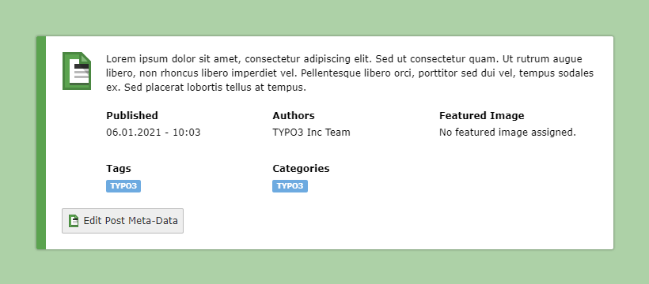

.. include:: ../Includes.txt

.. _Features:

========
Features
========

The main goal for this blog extension is to use TYPO3 core concepts and
elements to provide a full-blown blog that users of TYPO3 can instantly
understand and use.

Pages as blog entries
=====================
Blog entries are simply pages with a special page type blog entry and can be
created and edited via the well-known page module. Creating new entries is as
simple as dragging a new entry into the page tree.

The extension registers two page types:

- blog post: ``doktype 137``
- blog page: ``doktype 138``

Post information in backend page header
=======================================

The TYPO3 page and the list module show additional information for blog
posts. Information that is normally hidden in the page settings is now
visible to the editor. The new information bar is enabled by default but
can be disabled in the extension settings.

Use all your content elements
=============================

All your existing elements can be used on the blog pages - including
backend layouts, custom content elements or plugins.

Flexible positioning
====================

All parts of your new blog are usable on their own, so you can just use the
elements you want. The different elements include for example the comments
and comment form, a sidebar or the list of blog posts. All these elements
can be used as separate content elements and therefore be positioned and used
wherever you want.

Customizable Templates
======================

Templating is done via Fluid templates. If you want your blog to have a custom
look and feel just replace the templates and styles with your own. If you just
want a quick blog installation, use the templates provided by the extension and
just add your stylesheets.

Categorizing and Tagging
========================

Use TYPO3 system categories and custom blog tags to add meta information to
your blog posts. Visitors can browse posts by category, tag, author or date.
Related posts are calculated from matching categories and tags.

Integration and Standalone Mode
===============================

The blog ships public site sets for standalone blogs, integration into an
existing site, and modern Bootstrap or Tailwind template variants. See
:ref:`ConfigurationSiteSets`.

Workspace Support
=================

The blog extension fully supports TYPO3 Workspaces. Stage blog posts,
tags, and authors in a workspace before publishing to the live site.
Comments remain live-editable regardless of workspace state.

See :ref:`Workspaces <Workspaces>` for details.

Version Compatibility
=====================

.. list-table::
   :header-rows: 1
   :widths: 20 25 15

   * - Blog Extension
     - TYPO3
     - PHP
   * - 14.x
     - 14.3-14.x
     - 8.2-8.4
